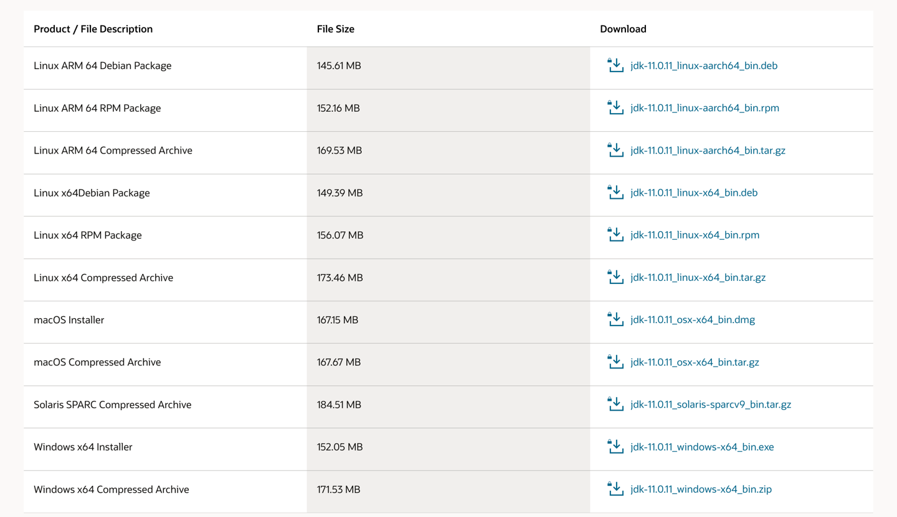
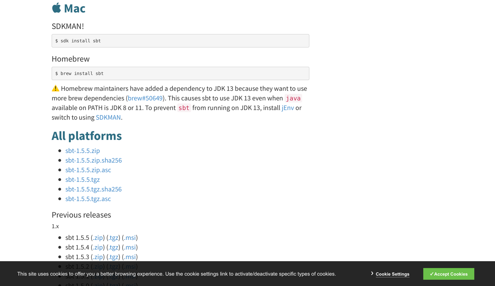
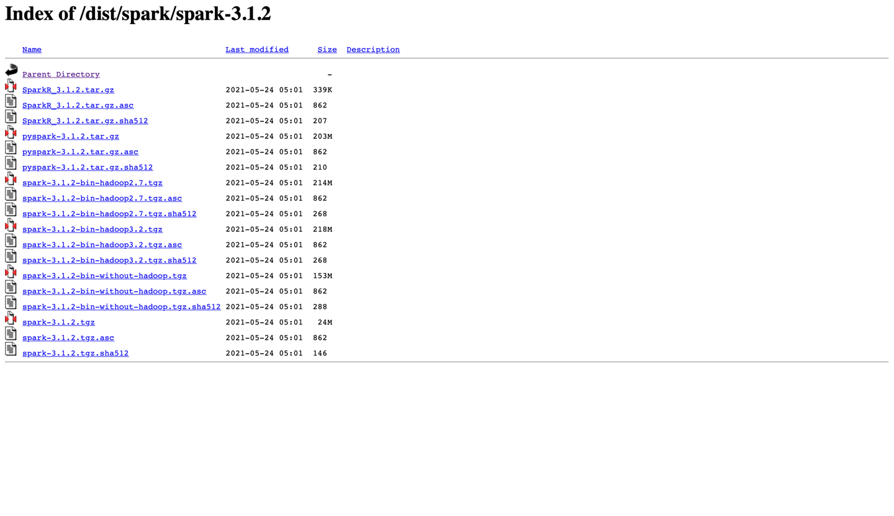
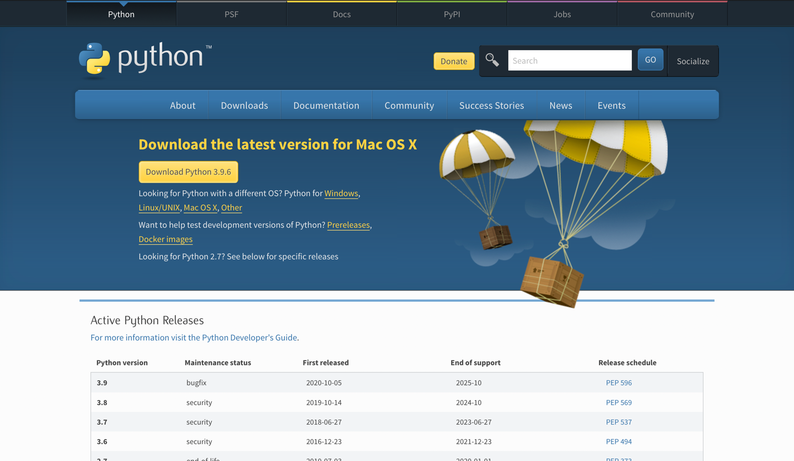
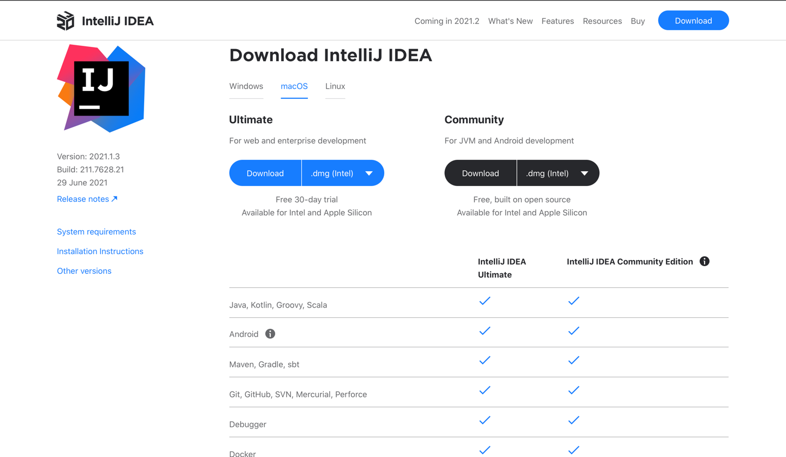

# Spark ML Workshop

This project contains tasks for getting acquainted with the Spark MLlib library.
After getting acquainted with the structure of the project and installing the necessary dependencies, you can proceed to the task `task1.md`.

## Project Structure

    .
    └───SparkMLCourse                         # Project folder
        ├──data                               # Folder with the data that will be required when performing the task
        │  └──titanic                         # Folder with titanic data
        │     ├──gender_submission.csv        # Answers for the test set
        │     ├──test.csv                     # Test set
        │     └──train.csv                    # Training set
        ├──images                             # Images for README
        ├──SparkCustomMLSkeleton              # Code skeleton with custom transformers and estimators
        ├──SparkCustomMLPipeline              # Code example with custom transformers and estimators and basic pipeline
        ├──SparkMLPipeline                    # Project example with Spark ML
        ├──task1.md                           # Task 1 description
        └──README.md                          # Awesome README

## Setting up the environment

As a rule, Spark is installed on clusters and allows you to run tasks on the nodes of this cluster.
However, Spark can also be run in local mode. This allows you to install it on any computer or laptop and create and test pipelines on it, and then the same code can be used on a real cluster.
This module provides instructions for installing the necessary components.

We will need:
* **Java Development Kit (JDK)** - is an implementation of either one of the Java Platform, Standard Edition, Java Platform, Enterprise Edition, or Java Platform, Micro Edition platforms released by Oracle Corporation in the form of a binary product aimed at Java developers on Solaris, Linux, macOS or Windows.
  The JDK includes a private JVM, and a few other resources to finish the development of a Java application.
  Since the introduction of the Java platform, it has been by far the most widely used Software Development Kit (SDK).
* **Scala** -  is a strong statically typed general-purpose programming language which supports both object-oriented programming and functional programming.
* **sbt** - is an open-source build tool for Scala and Java projects, similar to Apache's Maven and Ant.
* **Python** - is an interpreted high-level general-purpose programming language.
* **Apache Spark** - is an open-source unified analytics engine for large-scale data processing.
* **Integrated development environment (IDE)** - is any code redactor.

### Installing JDK

It is recommended to use JDK11.

1. Go to: https://www.oracle.com/java/technologies/javase-jdk11-downloads.html
2. Choose your platform and download the installer.
3. Install it.

### Installing sbt

It is recommended to use the latest version.

1. Go to https://www.scala-sbt.org/download.html
2. Depending on your platform, run the appropriate commands, or download the archive with the installer and install it.

### Installing Scala

It is recommended to use Scala 2.12.x.

1. Go to https://www.scala-lang.org/download/2.12.14.html
2. Choose your platform and download the installer.
3. Install it.

### Installing Spark

It is recommended to use Spark 3.x.x.

1. Go to https://archive.apache.org/dist/spark/spark-3.1.2/
2. Download "without-hadoop" version.
3. Install it.

### Installing Python

It is recommended to use Python 3.x.x.

1. Go to https://www.python.org/downloads/
2. Choose your platform and download the installer.
3. Install it.

### IDE

You can develop in any code editor that is convenient for you.
We recommend using Intellij IDEA.

To install Intellij IDEA:
1. Go to https://www.jetbrains.com/idea/download/#section=mac
2. Choose your platform and download the installer.
3. Install it. NOTE: During installation, it is also recommended installing the Scala plugin.

